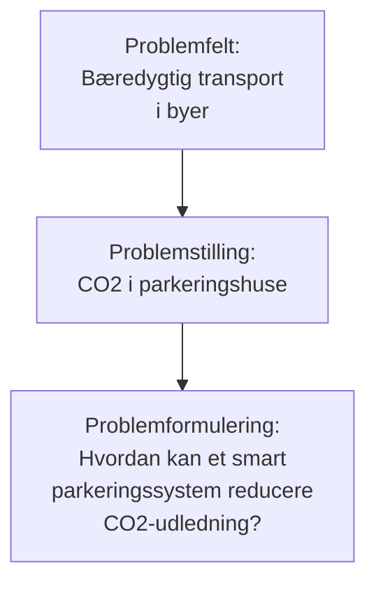
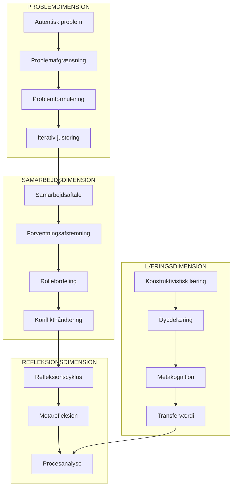

# 🎯 PBL Fagtermer & Eksamensvokabular

> [!tip] Formål med denne fil
> Denne fil mapper jeres procesanalyse til relevante PBL-fagtermer.  Brug den til at "oversætte" jeres erfaringer til akademisk sprog under eksamen.

---

## 📋 Hurtig Oversigt:  Jeres Proces → Fagtermer

| Hvad I gjorde/oplevede | Fagterm at bruge | Side i PBL-bogen |
|------------------------|------------------|------------------|
| Brugte mindmaps til idéudvikling | **Eksperimenterende idéudvikling** | - |
| Ændrede problemformulering løbende | **Iterativ problemafgrænsning** | - |
| Havde problemer med fremmøde | **Forventningsafstemning**, **Læringsstilsdifferentiering** | - |
| Lavede gruppekontrakt | **Samarbejdsaftale**, **Procedurel koordinering** | - |
| Brugte GitHub til planlægning | **Digital projektstyring**, **Asynkron koordinering** | - |
| CO2 i parkeringshuse | **Praktisk problem**, **Autentisk problemstilling** | s. 47-48 |
| Vejleder læste og kommenterede | **Stilladsering**, **Formativ feedback** | - |
| Diskuterede konflikter åbent | **Konstruktiv konflikthåndtering** | - |

---

# 🔤 Alfabetisk Begrebsliste

## A

### Abduktion
> [!abstract] Definition
> En slutningsform hvor man ud fra en observation formulerer den mest sandsynlige forklaring.  Ligger mellem induktion og deduktion.

**Jeres kontekst**:  Når I observerede at fremmøde var lavt, kunne I *abducere* at årsagen var manglende forventningsafstemning omkring læringsstile. 

---

### Afgrænsning
> [!abstract] Definition
> Processen med at indsnævre et bredt problemfelt til en håndterbar og undersøgelig problemformulering. 

**Jeres kontekst**: 
> *"Vi har kunnet afgrænse problemet til en håndterbar størrelse ved fx at abstrahere konceptet af en parkeringsplads til en samling af veje og pladser"*

**Eksamenssætning**: *"Vi foretog en systematisk afgrænsning af problemfeltet gennem iterative justeringer af problemformuleringen."*

---

### Aktionslæring
> [!abstract] Definition
> Læring der sker gennem handling og efterfølgende refleksion over handlingen.  Tæt forbundet med Kolbs læringscyklus.

**Jeres kontekst**:  Jeres erkendelse af at gruppekontrakten ikke fungerede → tilpasning → ny læring.

---

### Autentisk problem
> [!abstract] Definition
> Et problem der eksisterer i den virkelige verden og har reel relevans for praksis – modsat konstruerede eller kunstige problemer.

**Jeres kontekst**: CO2-udledning i parkeringshuse er et **autentisk problem** med konkrete konsekvenser for luftkvalitet og bæredygtighed.

---

## D

### Dybdelæring vs. Overfladelæring
> [!abstract] Definition
> **Dybdelæring**:  Forståelsesorienteret læring hvor man søger mening og sammenhæng. 
> **Overfladelæring**: Reproduktionsorienteret læring fokuseret på at huske fakta.

**Jeres kontekst**: Jeres metarefleksion viser tegn på dybdelæring – I reflekterer over *hvorfor* ting gik som de gjorde, ikke bare *hvad* der skete.

**Eksamenssætning**: *"Procesanalysen har faciliteret dybdelæring, idet vi ikke blot beskriver hændelser, men analyserer underliggende årsager og sammenhænge."*

---

### Deltager-/studerendestyring
> [!abstract] Definition
> PBL-princip om at studerende har indflydelse på og ansvar for egen læreproces, valg af problemstilling og arbejdsmetoder.

**Jeres kontekst**: I valgte selv jeres problem (CO2 i parkeringshuse), metoder (GitHub, FigJam) og arbejdsform. 

> [!warning] Kritisk refleksion
> Jeres procesanalyse viser også udfordringer ved deltager-styring:  *"energien ofte blev placeret her [kurser] og projektet dermed ofte blev lidt en eftertanke"* – dette er en klassisk udfordring ved høj grad af autonomi.

---

## E

### Eksemplarisk læring/princip
> [!abstract] Definition
> Princippet om at arbejde med ét konkret eksempel (case) kan give indsigt i generelle principper og strukturer.  Det specifikke belyser det almene. 

**Jeres kontekst**: Jeres parkeringshus-case er et **eksempel** der belyser generelle problemstillinger omkring: 
- Bæredygtig byinfrastruktur
- Optimering af ressourceforbrug
- Teknologisk innovation

**Eksamenssætning**: *"Gennem eksemplarisk læring har vi via parkeringshus-casen opnået indsigt i generelle principper for bæredygtig teknologiudvikling."*

---

### Erkendelsesinteresse
> [!abstract] Definition
> Den type viden eller forståelse man søger at opnå.  Typisk skelnes mellem: 
> - **Teknisk**:  Forklaring, forudsigelse, kontrol
> - **Praktisk**: Forståelse, fortolkning, mening
> - **Emancipatorisk**: Frigørelse, kritik, forandring

**Jeres kontekst**: Jeres projekt har primært en **teknisk erkendelsesinteresse** (løse et praktisk problem), men også elementer af **emancipatorisk** interesse (bæredygtighed, FN's verdensmål).

---

### Etiske overvejelser
> [! abstract] Definition
> Systematisk refleksion over moralske aspekter af problemløsning, teknologianvendelse og konsekvenser for berørte parter.

**Jeres kontekst**:
> *"Vi har desuden også gjort os nogle etiske overvejelser omkring brugen af data i parkeringssystemer, f.eks. hvordan registrering af bilers færden bør håndteres ansvarligt"*

**Eksamenssætning**: *"Vi har integreret etiske overvejelser i vores teknologivurdering, særligt vedrørende privatlivshensyn og datasikkerhed."*

---

## F

### Forventningsafstemning
> [!abstract] Definition
> Processen hvor gruppemedlemmer eksplicit kommunikerer og afstemmer forventninger til ambitionsniveau, arbejdsindsats, mødetider m.m.

**Jeres kontekst**:
> *"Der blev ikke udvekslet ambitions niveau for projektet, det tætteste var en udveksling over de enkelte gruppemedlemmers faglige niveau."*

> [!warning] Kritisk pointe til eksamen
> I erkender at forventningsafstemningen var **mangelfuld** – dette er god selvkritik.  Brug termen:  *"Retrospektivt kan vi identificere at vores forventningsafstemning var utilstrækkelig, særligt hvad angår ambitionsniveau."*

---

### Formativ feedback
> [!abstract] Definition
> Løbende feedback der gives undervejs i processen med henblik på forbedring – modsat summativ feedback der evaluerer slutproduktet.

**Jeres kontekst**:  Vejlederens ugentlige kommentarer på jeres materiale var **formativ feedback**. 

---

## G

### Gruppekontrakt / Samarbejdsaftale
> [!abstract] Definition
> Skriftlig aftale der formaliserer gruppens fælles forventninger, regler og procedurer for samarbejdet.

**Jeres kontekst**: I lavede en gruppekontrakt med mødetider, deadlines og konsekvenser. 

> [!example] Elementer I nævner
> - Mødetider (kl. 9-16)
> - Gruppens deadlines
> - Konsekvenser ved udeblivelse
> - Værktøjer

**Kritisk refleksion**: *"Gruppen designede 'hurtigt' en gruppekontrakt, men pga. fravær/udeblivelse, fik alle gruppemedlemmer først set og læst den op til 5 dage efter"* – dette viser vigtigheden af **procedurel legitimitet** (at alle er med fra start).

---

## I

### Iterativ proces
> [!abstract] Definition
> En arbejdsproces præget af gentagne cyklusser af udvikling, afprøvning, evaluering og tilpasning.

**Jeres kontekst**: Jeres problemformulering gennemgik flere **iterationer**:
1.  Første version (for upræcis)
2. Justering efter statusseminar
3. Løbende tilpasninger

**Eksamenssætning**: *"Vores problemformulering blev udviklet iterativt gennem flere revisioner baseret på vejlederfeedback og øget domæneforståelse."*

---

## K

### Konflikthåndtering
> [!abstract] Definition
> Strategier og processer til at håndtere uenigheder og spændinger i gruppearbejde konstruktivt. 

**Jeres kontekst**:
> *"Vi har håndteret konflikter ved at tale om den åbent i grupperummet"*

**Fagterm**: Dette er **åben/direkte konflikthåndtering** – en konstruktiv tilgang modsat undvigelse eller eskalering.

---

### Konstruktivisme
> [!abstract] Definition
> Læringsteoretisk perspektiv hvor viden ikke overføres passivt, men aktivt konstrueres af den lærende gennem erfaring og refleksion.

**Jeres kontekst**:  Hele jeres projekt illustrerer konstruktivistisk læring – I har selv konstrueret forståelse gennem problemarbejde.

---

## L

### Læringsstile
> [!abstract] Definition
> Individuelle præferencer for hvordan man bedst tilegner sig og bearbejder viden (fx visuel, auditiv, kinestetisk; eller Kolbs fire stile).

**Jeres kontekst**:
> *"Det er formålet med PBL, at det skal lære os at acceptere forskellige læringsstile"*
> *"Mange i gruppen har været dårlige til at møde op, hvilket kan indikere at nogle af os foretrækker at arbejde andre steder"*

> [!tip] Eksamenssætning
> *"Vi erkender retrospektivt at vi ikke i tilstrækkelig grad accommoderede for differentierede læringsstile i gruppen, hvilket manifesterede sig i fremmødeproblematikker."*

---

## M

### Metakognition
> [!abstract] Definition
> "Tænkning om tænkning" – bevidsthed om og regulering af egne kognitive processer og læringsstrategier.

**Jeres kontekst**: Hele procesanalysen er et **metakognitivt produkt** – I reflekterer over jeres egen proces.

---

### Metarefleksion
> [! abstract] Definition
> Refleksion på et højere abstraktionsniveau – refleksion over refleksionen, eller refleksion over hele læreprocessen.

**Jeres kontekst**: Jeres afsnit "Metarefleksion" demonstrerer dette eksplicit. 

**Eksamenssætning**: *"Gennem metarefleksion har vi identificeret centrale læringspunkter der transcenderer det specifikke projekt."*

---

## P

### Praktisk vs. Teoretisk problem
> [!abstract] Definition
> - **Praktisk problem**: Noget der skal løses/ændres i virkeligheden
> - **Teoretisk problem**: Noget der skal forstås/forklares

**Jeres kontekst**:
> *"Vores problem er CO2 udledning i parkeringshuse og det er primært et praktisk problem [... ] Problemet er dog også brugt teoretisk, da der er blevet udregnet CO2 udledningen pr. bil"*

**Eksamenssætning**: *"Vores problemstilling integrerer både praktiske og teoretiske dimensioner – det praktiske forandringsproblem er understøttet af teoretisk analyse."*

---

### Problembaseret læring (PBL)
> [!abstract] Definition
> Pædagogisk tilgang hvor komplekse, autentiske problemer udgør udgangspunktet for læring.  Studerende arbejder selvstændigt og i grupper med at identificere læringsbehov, søge viden og anvende den på problemet.

**Jeres forståelse**:
> *"Måden vi forstår PBL på er, at det er et værktøj som skal hjælpe os med arbejde bedre som en gruppe."*

> [!warning] Udvidelse til eksamen
> PBL handler også om: 
> - **Epistemologiske principper** (viden skabes gennem problemkonfrontation)
> - **Eksemplarisk læring** (det specifikke belyser det generelle)
> - **Teori-praksis-integration**

---

### Problemfelt → Problemformulering
> [!abstract] Definition
> **Problemfelt**: Det brede område/tema man interesserer sig for
> **Problemformulering**:  Det præcise, afgrænsede spørgsmål man vil besvare

---

### Procedurel koordinering
> [! abstract] Definition
> Etablering af fælles procedurer, regler og rutiner for gruppearbejde – fx mødestruktur, kommunikationskanaler, deadlines. 

**Jeres kontekst**:  Gruppekontrakten er et eksempel på **procedurel koordinering**. 

---

### Projektledelse
> [!abstract] Definition
> Systematisk planlægning, organisering og styring af projektaktiviteter mod opfyldelse af projektmål.

**Jeres kontekst**: I brugte GitHub Issues, FigJam flowcharts og tidsplaner som **projektledelsesværktøjer**.

---

## R

### Refleksionscyklus
> [!abstract] Definition
> Systematisk model for refleksion, typisk med faser som: Erfaring → Beskrivelse → Analyse → Konklusion → Handling (jf. Gibbs, Kolb).

**Jeres kontekst**: Procesanalysen følger implicit en refleksionscyklus:
1. Hvad skete? (beskrivelse af samarbejdet)
2. Hvad gik godt/dårligt? (evaluering)
3. Hvorfor?  (analyse)
4. Hvad gør vi anderledes? (handlingsplan)

---

### Rollefordeling
> [!abstract] Definition
> Eksplicit eller implicit fordeling af funktioner og ansvarsområder i gruppearbejde.

**Jeres kontekst**:
> *"I vores gruppe har vi dog ikke haft så mange forskellige roller, men allesammen fungeret på samme vilkår."*

> [!tip] Kritisk refleksion til eksamen
> *"Vi opererede primært med en flad rollestruktur, hvilket havde fordele i form af ligeværdighed, men ulemper i form af uklar ansvarsplacering.  Fremadrettet vil vi implementere mere eksplicit rolledifferentiering."*

---

## S

### SDG'er / FN's Verdensmål
> [! abstract] Definition
> De 17 Sustainable Development Goals vedtaget af FN i 2015, som udgør en global ramme for bæredygtig udvikling.

**Jeres kontekst**: I relaterer til: 
- Mål 9: Industri, innovation og infrastruktur
- Mål 11: Bæredygtige byer og lokalsamfund
- Mål 13: Klimaindsats

**Eksamenssætning**: *"Projektet er forankret i en bæredygtighedsramme med reference til SDG 9, 11 og 13, hvilket sikrer samfundsmæssig relevans."*

---

### Stilladsering (Scaffolding)
> [!abstract] Definition
> Midlertidig støtte til læring der gradvist fjernes efterhånden som den lærende bliver mere selvstændig.  Begrebet stammer fra Vygotsky/Bruner.

**Jeres kontekst**: Vejlederens feedback fungerede som **stilladsering** – støtte der hjalp jer videre i processen.

> [!warning] Jeres kritik
> *"Vi kunne godt have ønsket os mere kommunikation fra vejlederen"* – I oplevede at stilladseringen var **utilstrækkelig** i startfasen.

---

### Synkron vs. Asynkron kommunikation
> [!abstract] Definition
> - **Synkron**: Kommunikation i realtid (møder, opkald)
> - **Asynkron**: Kommunikation med tidsforsinkelse (email, chat)

**Jeres kontekst**:
> *"Hvis ikke vi har arbejdet fælles på Cassiopeia, så har vi kommunikeret mere digitalt [... ] over Messenger, Discord"*

Discord-opkald = synkron; Messenger-beskeder = asynkron

---

## T

### Teknologivurdering (Technology Assessment)
> [!abstract] Definition
> Systematisk analyse af teknologiers konsekvenser – funktionelle, økonomiske, sociale, miljømæssige og etiske. 

**Jeres kontekst**: I foretager implicit teknologivurdering når I overvejer: 
- Privatliv og datasikkerhed
- Miljømæssig impact (CO2-reduktion)
- Potentielt misbrug

---

### Teori-praksis-kobling
> [!abstract] Definition
> PBL-princip om at teoretisk viden skal forbindes med og anvendes på praktiske problemstillinger.

**Jeres kontekst**: I kobler teoretisk viden (CO2-beregninger) med praktisk probleml��sning (parkeringssystem).

---

### Transferværdi
> [!abstract] Definition
> I hvilken grad læring fra én kontekst kan overføres og anvendes i andre kontekster.

**Jeres kontekst**:
> *"Vi kan tage meget med videre fra P1. Ting som GitHub og Typst er noget vi helt sikkert vil komme til at bruge"*

**Eksamenssætning**: *"Projektet har genereret betydelig transferværdi i form af metodiske kompetencer og værktøjskendskab der er applikerbare i fremtidige projekter."*

---

## V

### Vejlederkontrakt
> [!abstract] Definition
> Formel eller uformel aftale mellem projektgruppe og vejleder om samarbejdsform, mødefrekvens, forventninger m.m.

**Jeres kontekst**: I havde faste møder onsdage kl. 13. 30 – dette udgør en implicit vejlederkontrakt. 

---

### Vidensproduktion
> [!abstract] Definition
> Processen hvorigennem ny viden skabes, valideres og dokumenteres i et projekt.

**Jeres kontekst**:  Jeres projekt producerede viden om:
1. CO2-problematikken (domæneviden)
2. Teknisk løsning (løsningsviden)
3. Samarbejdsprocesser (procesviden)

---

### Visuelt værktøj / Visualisering
> [! abstract] Definition
> Brug af visuelle repræsentationer (diagrammer, mindmaps, flowcharts) til at understøtte tænkning og kommunikation.

**Jeres kontekst**:  Mindmaps, FigJam flowcharts – *"har fungeret rigtig godt for at skabe et overblik og fremme vores idéer"*

---

## Z

### Zone for nærmeste udvikling (ZNU/ZPD)
> [!abstract] Definition
> Vygotskys begreb for afstanden mellem hvad en lærende kan klare alene, og hvad vedkommende kan klare med støtte fra mere kompetente andre.

**Jeres kontekst**:  Vejlederfeedback og gruppediskussioner hjalp jer med at nå læring I ikke kunne have opnået alene.

---

# 🗣️ Sætningsskabeloner til Eksamen

## Til at beskrive problemer

| Situation | Faglig formulering |
|-----------|-------------------|
| Vi valgte et emne | *"Vi identificerede et autentisk problemfelt inden for bæredygtig byinfrastruktur"* |
| Vi indsnævrede fokus | *"Gennem systematisk afgrænsning kondenserede vi problemfeltet til en operationaliserbar problemformulering"* |
| Vi ændrede undervejs | *"Problemformuleringen gennemgik flere iterationer baseret på formativ vejlederfeedback"* |

## Til at beskrive samarbejde

| Situation | Faglig formulering |
|-----------|-------------------|
| Vi lavede gruppekontrakt | *"Vi etablerede en samarbejdsaftale med fokus på procedurel koordinering og forventningsafstemning"* |
| Det gik skidt med fremmøde | *"Vi oplevede udfordringer med implementering af den aftalte mødestruktur, hvilket indikerer behov for bedre accommodering af differentierede læringsstile"* |
| Vi løste konflikter | *"Konflikter blev håndteret gennem åben dialog, hvilket reflekterer en konstruktiv konflikthåndteringsstrategi"* |
| Nogen tog ansvar | *"Der var en uformel rolledifferentiering med én person ansvarlig for vejlederkommunikation"* |

## Til at beskrive læring

| Situation | Faglig formulering |
|-----------|-------------------|
| Vi lærte af fejl | *"Gennem aktionslæring og refleksiv praksis har vi transformeret proceserfaringer til transferérbar læring"* |
| Vi forstod emnet bedre | *"Projektet faciliterede dybdelæring om domænet gennem eksemplarisk engagement med problemstillingen"* |
| Vi reflekterede bagefter | *"Procesanalysen repræsenterer et metakognitivt produkt der dokumenterer vores refleksionscyklus"* |

## Til at beskrive teknologi/metoder

| Situation | Faglig formulering |
|-----------|-------------------|
| Vi brugte GitHub | *"Vi anvendte GitHub som digital infrastruktur for asynkron koordinering og versionsstyring"* |
| Vi lavede flowcharts | *"Visuelle værktøjer som flowcharts understøttede kollektiv meningsskabelse og systemforståelse"* |
| Vi overvejede etik | *"Vi integrerede etiske overvejelser i teknologivurderingen, særligt vedrørende privatlivshensyn"* |

---

# ⚡ Hurtigguide:  Jeres Svage Punkter → Stærke Formuleringer

> [!danger] Jeres udfordringer – formuleret akademisk

| Jeres ærlige beskrivelse | Akademisk reformulering |
|--------------------------|------------------------|
| *"Fremmøde har været dårligt"* | *"Vi oplevede diskrepans mellem den aftalte og den realiserede mødefrekvens, hvilket vi tilskriver utilstrækkelig forventningsafstemning og manglende hensyntagen til individuelle læringspræferencer"* |
| *"Gruppekontrakten virkede ikke"* | *"Den procedurale ramme viste sig at have implementeringsudfordringer, særligt fordi ikke alle gruppemedlemmer var involveret i den initiale formulering, hvilket kompromitterede den procedurale legitimitet"* |
| *"Vi manglede vejledning"* | *"Stilladseringen var suboptimal i projektets indledende fase, hvilket resulterede i øget usikkerhed omkring projektretning"* |
| *"Projektet blev en eftertanke"* | *"Kursusaktiviteter tenderede mod at fortrænge projektarbejdet, hvilket indikerer behov for bedre integration af parallelle læringsaktiviteter"* |
| *"Vi nåede ikke deadlines"* | *"Tidsplanen viste sig at være for ambitiøs i forhold til de faktiske ressourcer, hvilket nødvendiggjorde løbende rekalibrering"* |

---

# 📊 Begrebskort:  Sammenhænge

---

# ✅ Tjekliste: Begreber I SKAL kunne forklare

## Kernebegreber (skal kunne definere + eksemplificere)

- [ ] **PBL** – definition + de 7 principper
- [ ] **Problemformulering** – kvalitetskriterier
- [ ] **Eksemplarisk læring** – hvad betyder det?
- [ ] **Samarbejdsaftale** – formål og indhold
- [ ] **Forventningsafstemning** – hvorfor vigtigt?
- [ ] **Iterativ proces** – hvad indebærer det?
- [ ] **Dybdelæring vs. overfladelæring**
- [ ] **Stilladsering** – vejlederens rolle

## Begreber I bør kunne anvende

- [ ] **Metakognition/metarefleksion**
- [ ] **Konstruktivisme**
- [ ] **Teknologivurdering**
- [ ] **Transferværdi**
- [ ] **Praktisk vs. teoretisk problem**
- [ ] **Synkron vs.  asynkron kommunikation**

## Begreber der imponerer

- [ ] **Zone for nærmeste udvikling**
- [ ] **Procedurel legitimitet**
- [ ] **Erkendelsesinteresse**
- [ ] **Abduktion**
- [ ] **Aktionslæring**

---

> [!success] Husk til eksamen
> **Det handler ikke om at bruge flest mulige fagtermer**, men om at bruge dem **præcist** og **relevant**. 
> 
> Vis at I **forstår** begreberne ved at koble dem til **konkrete eksempler** fra jeres proces! 
