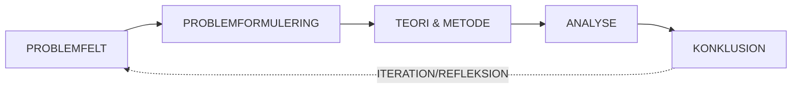
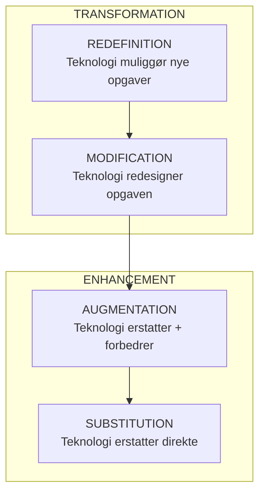
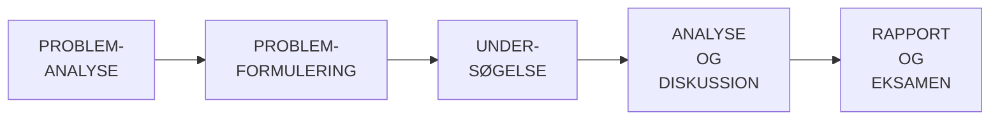
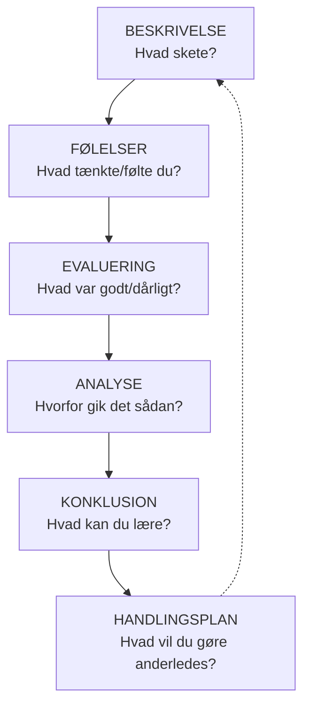
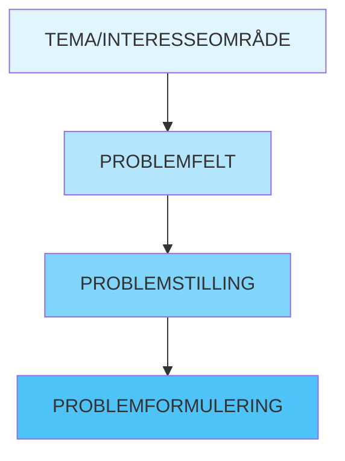
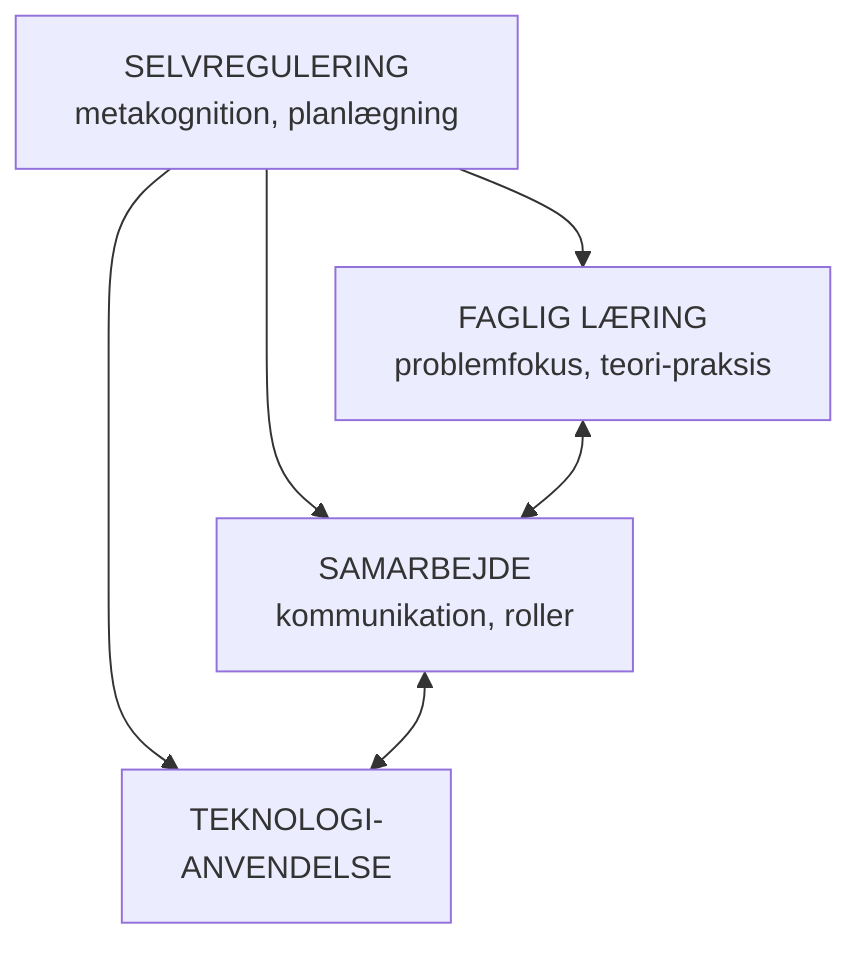
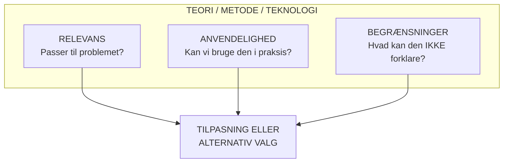

# 📚 PBL Eksamensnoter

> [!info] Kilde
> Baseret på *"PBL:  Problembaseret læring og projektarbejde ved de videregående uddannelser, 2. udg."*

---

## 📋 Indholdsfortegnelse

- [[#DEL 1 VIDEN|DEL 1: VIDEN]]
  - [[#1.1 Definition af Problembaseret Læring (PBL)]]
  - [[#1.2 Problem- og Projekttyper]]
  - [[#1.3 Vidensproduktion og Videnskabsteori]]
  - [[#1.4 Digitale og Analoge Teknologier]]
- [[#DEL 2 FÆRDIGHEDER|DEL 2: FÆRDIGHEDER]]
  - [[#2.1 Planlægning og Styring af Projektarbejde]]
  - [[#2.2 Analyse og Evaluering af Egen Studiepraksis]]
  - [[#2.3 Problemidentifikation, -analyse og -formulering]]
  - [[#2.4 Teknologivurdering med Fokus på Bæredygtighed og Etik]]
- [[#DEL 3 KOMPETENCER|DEL 3: KOMPETENCER]]
  - [[#3.1 Udvikling af Studiepraksis i PBL-miljø]]
  - [[#3.2 Evaluering af Videnskabelige Praksisser]]
  - [[#3.3 Evaluering og Tilpasning af Teorier, Metoder og Teknologier]]
  - [[#3.4 Vurdering af Egen Progression i PBL]]
  - [[#3.5 Kritisk Refleksion over Digitale Teknologiers Rolle]]
- [[#DEL 4 EKSAMENSSTRATEGIER|DEL 4: EKSAMENSSTRATEGIER]]

---

# DEL 1: VIDEN

## 1.1 Definition af Problembaseret Læring (PBL)

### Kernedefinition

> [!abstract] Definition
> PBL er en **pædagogisk tilgang**, hvor læring organiseres omkring **problemer** frem for faglige discipliner. De studerende arbejder i grupper med autentiske, komplekse problemer som udgangspunkt for at tilegne sig viden og færdigheder.

### Læringsteoretisk fundament

| Teori | Centrale begreber | Relevans for PBL |
|-------|-------------------|------------------|
| **Konstruktivisme** (Piaget) | Læring som aktiv konstruktion af viden | Studerende konstruerer selv forståelse gennem problemarbejde |
| **Social konstruktivisme** (Vygotsky) | Zone for nærmeste udvikling, stilladsering | Gruppearbejde og vejledning understøtter læring |
| **Situeret læring** (Lave & Wenger) | Praksisfællesskaber, legitim perifer deltagelse | Problemer forankret i autentisk praksis |
| **Erfaringsbaseret læring** (Dewey, Kolb) | Learning by doing, refleksion over handling | Læring gennem konkret problemløsning og refleksion |
| **Transformativ læring** (Mezirow) | Kritisk refleksion, perspektivændring | Dybe læringsprocesser gennem problemkonfrontation |

### De syv principper for PBL (Aalborg-modellen)

> [!important] De 7 PBL-principper
> 1. **Problemorientering** – Problemer som udgangspunkt for læring
> 2. **Projektorientering** – Længerevarende, selvstændigt projektarbejde
> 3. **Tværfaglighed** – Integration af flere fagområder
> 4. **Deltager-/studerende-styring** – Studerende har medbestemmelse
> 5. **Gruppebaseret arbejde** – Samarbejde som læringsform
> 6. **Eksemplarisk læring** – Det specifikke eksempel belyser generelle principper
> 7. **Teori-praksis-kobling** – Vekslen mellem teori og anvendelse

### Relation til egne erfaringer

> [!question] Refleksionspunkter
> - Hvordan har I oplevet forskellen på traditionel undervisning vs. PBL?
> - Hvornår har problemorientering motiveret jeres læring?
> - Hvilke udfordringer har I mødt i gruppearbejde?

---

## 1.2 Problem- og Projekttyper

### Problemtyper

| Type | Karakteristika | Eksempel |
|------|----------------|----------|
| **Forklaringsproblemer** | Søger at forstå *hvorfor* noget er, som det er | "Hvorfor falder studerende fra?" |
| **Forandringsproblemer** | Søger at ændre en uønsket tilstand | "Hvordan kan frafald reduceres?" |
| **Design-/konstruktionsproblemer** | Skabe noget nyt | "Udvikl et støttesystem for studerende" |
| **Anomali-/paradoks-problemer** | Uforklarlige fænomener eller modsætninger | "Hvorfor stiger frafald trods flere ressourcer?" |

### Problemformuleringens anatomi

> [!tip] En god problemformulering indeholder
> - **Genstandsfelt**:  Hvad handler det om?
> - **Problemstilling**: Hvad er problemet/spændingen?
> - **Erkendelsesinteresse**: Hvad vil vi opnå (forklaring, forståelse, forandring)?

### Projekttyper

| Type | Fokus | Vidensproduktion |
|------|-------|------------------|
| **Disciplinprojekt** | Teoretisk fordybelse i ét fagområde | Fagspecifik viden |
| **Problemorienteret projekt** | Løsning af et reelt problem | Anvendelsesorienteret viden |
| **Fagintegrationsprojekt** | Kombination af flere discipliner | Tværfaglig syntese |
| **Deltagerstyret projekt** | Høj grad af studerende-autonomi | Selvstændig erkendelse |

### Relation til egen praksis

> [!question] Refleksionspunkter
> - Hvilken problemtype arbejder I med i jeres projekt?
> - Hvordan påvirker problemtypen jeres metodiske valg?
> - Hvilken projekttype ligner jeres nuværende projekt mest?

---

## 1.3 Vidensproduktion og Videnskabsteori

### Vidensproduktion i PBL-projekter

### Videnskabsteoretiske paradigmer

| Paradigme | Ontologi | Epistemologi | Metode | Typiske problemer |
|-----------|----------|--------------|--------|-------------------|
| **Positivisme** | Objektiv virkelighed | Værdifri observation | Kvantitativ, eksperimentel | Årsagsforklaringer |
| **Hermeneutik** | Fortolket virkelighed | Forståelse i kontekst | Kvalitativ, fortolkende | Betydning og mening |
| **Kritisk teori** | Socialt konstrueret | Afsløring af magtstrukturer | Kritisk analyse | Frigørelse, forandring |
| **Pragmatisme** | Virkelighed i handling | Viden som handlingsredskab | Problemløsningsorienteret | Praktiske problemer |
| **Socialkonstruktivisme** | Sprogligt konstrueret | Viden som social forhandling | Diskursanalyse | Konstruktion af viden |

### Sammenhæng mellem problemtype og videnskabsteori

| Problemtype | Typisk paradigme | Metodisk konsekvens |
|-------------|------------------|---------------------|
| Forklaringsproblemer | Positivisme/Realisme | Kausalanalyse, kvantitative data |
| Forståelsesproblemer | Hermeneutik | Fortolkning, kvalitative metoder |
| Forandringsproblemer | Kritisk teori/Pragmatisme | Aktionsforskning, interventioner |
| Designproblemer | Pragmatisme | Iterativ udvikling, prototyping |

### Nøglebegreber

> [!note] Centrale begreber
> - **Induktion**: Fra empiri til teori
> - **Deduktion**: Fra teori til empiri
> - **Abduktion**:  Kvalificeret gætværk – fra observation til bedste forklaring
> - **Triangulering**: Kombination af flere metoder/datakilder

---

## 1.4 Digitale og Analoge Teknologier

### Teknologiforståelse i PBL

| Teknologitype | Eksempler | Funktion i PBL |
|---------------|-----------|----------------|
| **Kommunikationsteknologi** | Teams, Slack, email, videomøder | Synkron/asynkron dialog |
| **Samarbejdsværktøjer** | Google Docs, Miro, SharePoint | Fælles dokumentproduktion |
| **Vidensstyring** | Notion, wikis, referencehåndtering | Organisering af information |
| **Projektledelse** | Trello, Asana, Gantt-diagrammer | Planlægning og overblik |
| **Analoge teknologier** | Whiteboards, post-its, fysiske møder | Kreativitet, nærvær, spontanitet |

### SAMR-modellen (Puentedura)

### Teknologi og læringssyn

| Læringssyn | Teknologiens rolle | Eksempel |
|------------|-------------------|----------|
| **Behavioristisk** | Drill, øveprogrammer | Quizlet, flashcards |
| **Kognitivistisk** | Strukturering af viden | Mindmaps, skemaværktøjer |
| **Konstruktivistisk** | Værktøj til aktiv konstruktion | Simuleringer, designværktøjer |
| **Socialkonstruktivistisk** | Mediering af samarbejde | Wikis, kollaborative platforme |

---

# DEL 2: FÆRDIGHEDER

## 2.1 Planlægning og Styring af Projektarbejde

### Projektfaser i PBL

### Værktøjer til projektstyring

| Værktøj | Anvendelse | Fordele |
|---------|------------|---------|
| **Samarbejdsaftale** | Etablere fælles forventninger | Forebygger konflikter |
| **Tidsplan/Gantt** | Overblik over milepæle og deadlines | Strukturering |
| **Logbog** | Dokumentation af processer og beslutninger | Refleksion og hukommelse |
| **Dagsordener/referater** | Effektive møder | Fokus og kontinuitet |
| **Statusmøder** | Regelmæssig koordinering | Tidlig problemidentifikation |

### Samarbejdsaftale – centrale elementer

> [!example] Elementer i samarbejdsaftale
> 1. **Forventningsafstemning**:  Ambitionsniveau, tidsforbrug
> 2. **Kommunikation**: Kanaler, responstid
> 3. **Mødestruktur**: Hyppighed, format, roller
> 4. **Arbejdsfordeling**: Principper for opgavefordeling
> 5. **Konfliktløsning**: Procedure ved uenighed
> 6. **Kvalitetssikring**: Feedback, revision

### Grupperoller (Belbin-inspireret)

| Rolle | Bidrag | Svaghed |
|-------|--------|---------|
| Idémager | Kreativitet, problemløsning | Kan overse detaljer |
| Koordinator | Strukturering, delegering | Kan virke kontrollerende |
| Specialist | Dybdegående fagviden | Kan have snævert fokus |
| Fuldender | Kvalitetssikring, deadlines | Kan være perfektionistisk |
| Formidler | Netværk, eksterne kontakter | Kan miste fokus |

---

## 2.2 Analyse og Evaluering af Egen Studiepraksis

### Refleksionsmodel (Gibbs' refleksionscyklus)

### Evaluering af teknologibrug

| Evalueringskriterie | Spørgsmål til refleksion |
|--------------------|--------------------------|
| **Effektivitet** | Understøtter teknologien opgaveløsning? |
| **Tilgængelighed** | Kan alle gruppemedlemmer anvende teknologien? |
| **Læringspotentiale** | Fremmer teknologien dybdelæring eller overfladelæring? |
| **Samarbejdskvalitet** | Styrker teknologien kommunikation og koordinering? |
| **Bæredygtighed** | Er teknologien hensigtsmæssig på lang sigt? |

### Dybdelæring vs. overfladelæring

| Dimension | Overfladelæring | Dybdelæring |
|-----------|-----------------|-------------|
| **Fokus** | Reproduktion | Forståelse |
| **Motivation** | Ekstrinsisk (karakter) | Intrinsisk (interesse) |
| **Strategi** | Udenadslære | Meningsskabelse |
| **Sammenhæng** | Fragmenteret | Integreret |
| **PBL-kobling** | Svag problemengagement | Stærk problemengagement |

---

## 2.3 Problemidentifikation, -analyse og -formulering

### Fra interesseområde til problemformulering

### Kvalitetskriterier for problemformulering

| Kriterie | Forklaring | Tjekliste-spørgsmål |
|----------|------------|---------------------|
| **Relevans** | Problemet er væsentligt | Betyder det noget for nogen? |
| **Afgrænsning** | Klart defineret omfang | Kan det besvares inden for rammen? |
| **Åbenhed** | Ikke forudbestemt svar | Rummer det ægte undersøgelse? |
| **Kompleksitet** | Kræver analyse, ikke bare beskrivelse | Er der noget at finde ud af? |
| **Gennemførlighed** | Kan undersøges med tilgængelige ressourcer | Har vi adgang til data/metoder? |

### Systemperspektiv på problemanalyse

> [!info] Analyseniveauer
> Et systemperspektiv indebærer at forstå problemer som indlejret i større sammenhænge: 
> 
> - **Mikroniveau**: Individer, lokale praksisser
> - **Mesoniveau**: Organisationer, institutioner
> - **Makroniveau**: Samfund, strukturer, diskurser

> [!example] Eksempel:  Studiefrafald
> - **Mikro**: Individuel motivation, studieteknik
> - **Meso**: Undervisningsformer, studievejledning
> - **Makro**: Uddannelsespolitik, arbejdsmarkedsforhold

---

## 2.4 Teknologivurdering med Fokus på Bæredygtighed og Etik

### Teknologivurdering (Technology Assessment)

> [!abstract] Definition
> Systematisk analyse af teknologiers konsekvenser – før, under og efter implementering. 

### Vurderingsdimensioner

| Dimension | Spørgsmål | Eksempel |
|-----------|-----------|----------|
| **Funktionel** | Virker teknologien?  | Løser samarbejdsplatformen koordineringsproblemer? |
| **Økonomisk** | Hvad koster det? | Licenser, tidsforbrug, læringskurve |
| **Social** | Hvem påvirkes hvordan? | Digital eksklusion, ændrede magtforhold |
| **Miljømæssig** | Hvad er klimaaftrykket? | Energiforbrug, e-affald |
| **Etisk** | Er det rigtigt at gøre? | Privatliv, overvågning, autonomi |

### Bæredygtighedsperspektiver

| Bæredygtighedsform | Fokus | Relevans for PBL/teknologi |
|-------------------|-------|---------------------------|
| **Miljømæssig** | Klima, ressourcer | Digitale vs. fysiske møder, cloudlagring |
| **Social** | Lighed, inklusion, velvære | Tilgængelighed, digital kløft |
| **Økonomisk** | Langsigtede ressourcer | Omkostningseffektivitet, vedligeholdelse |

### Etiske overvejelser ved digital teknologi

| Etisk princip | Anvendelse | Spørgsmål |
|---------------|------------|-----------|
| **Autonomi** | Selvbestemmelse | Tvinges brugere ind i bestemte adfærdsmønstre? |
| **Privatliv** | Databeskyttelse | Hvilke data indsamles? Hvem har adgang? |
| **Transparens** | Gennemsigtighed | Forstår brugere, hvordan teknologien fungerer? |
| **Retfærdighed** | Lige behandling | Skaber teknologien nye uligheder? |
| **Ikke-skade** | Undgå skade | Kan teknologien misbruges? |

---

# DEL 3: KOMPETENCER

## 3.1 Udvikling af Studiepraksis i PBL-miljø

### Centrale elementer i PBL-studiepraksis

### Studiepraksis-profil – selvvurdering

| Kompetenceområde | Begynderniveau | Udviklet niveau | Ekspertniveau |
|------------------|----------------|-----------------|---------------|
| Problemidentifikation | Arbejder med givne problemer | Finder selv problemer | Vurderer problemers kompleksitet |
| Samarbejde | Deltager i gruppearbejde | Tager initiativ og ansvar | Faciliterer gruppeprocesser |
| Selvregulering | Følger planer fra andre | Planlægger egen indsats | Tilpasser strategier fleksibelt |
| Teknologibrug | Anvender basale værktøjer | Vælger relevante teknologier | Evaluerer og optimerer |

### Strategier for udvikling

> [!tip] 6 udviklingsstrategier
> 1. **Sæt læringsmål** – Hvad vil du udvikle? 
> 2. **Eksperimenter** – Prøv nye tilgange
> 3. **Dokumentér** – Hold logbog over erfaringer
> 4. **Reflektér** – Analysér, hvad der virker
> 5. **Justér** – Tilpas praksis baseret på indsigt
> 6. **Del** – Diskutér erfaringer med gruppen

---

## 3.2 Evaluering af Videnskabelige Praksisser

### Kvalitetskriterier for videnskabelig praksis

| Kriterie | Beskrivelse | Evalueringsspørgsmål |
|----------|-------------|---------------------|
| **Validitet** | Måler vi det, vi tror, vi måler?  | Er metoden velegnet til problemet? |
| **Reliabilitet** | Kan resultater gentages? | Er fremgangsmåden systematisk? |
| **Generaliserbarhed** | Kan konklusioner overføres? | Hvilke forbehold gælder? |
| **Transparens** | Er processen dokumenteret? | Kan andre følge ræsonnementet? |
| **Etisk forsvarlighed** | Er der taget etiske hensyn? | Er informeret samtykke sikret? |

### Kritisk vurdering af kilder (CRAAP-testen)

> [!warning] CRAAP-testen
> - **C**urrency (aktualitet): Er informationen opdateret?
> - **R**elevance (relevans): Passer det til problemet?
> - **A**uthority (autoritet): Hvem står bag?
> - **A**ccuracy (nøjagtighed): Er det underbygget?
> - **P**urpose (formål): Hvorfor er det skrevet?

### Refleksion over egen videnskabelig praksis

| Spørgsmål | Fokusområde |
|-----------|-------------|
| Hvorfor valgte vi denne metode? | Metodologisk begrundelse |
| Hvilke alternative tilgange overvejede vi? | Metodisk bredde |
| Hvilke begrænsninger har vores tilgang? | Selvkritik |
| Hvordan påvirker vores forforståelse analysen? | Bias-bevidsthed |
| Er vores konklusioner forsigtige nok? | Epistemisk ydmyghed |

---

## 3.3 Evaluering og Tilpasning af Teorier, Metoder og Teknologier

### Evalueringsramme

### Kriterier for teori-/metode-/teknologivalg

| Dimension | Overvejelser |
|-----------|--------------|
| **Ontologisk match** | Passer antagelserne til problemets natur? |
| **Epistemologisk match** | Producerer den den type viden, vi søger? |
| **Praktisk anvendelighed** | Har vi ressourcer til at bruge den? |
| **Etisk forsvarlighed** | Er der problematiske implikationer? |
| **Læringsmæssig værdi** | Understøtter den vores læring? |

### Tilpasningsstrategier

> [!example] 4 tilpasningsstrategier
> 1. **Kombination**:  Brug flere teorier/metoder der supplerer hinanden
> 2. **Modifikation**: Tilpas til konteksten
> 3. **Kritisk anvendelse**: Brug med eksplicitte forbehold
> 4. **Alternativt valg**: Skift til mere passende teori/metode

---

## 3.4 Vurdering af Egen Progression i PBL

### Progressionsmodel for PBL-kompetencer

| Niveau | Karakteristika | Indikatorer |
|--------|----------------|-------------|
| **Novice** | Regelstyret, afhængig af vejledning | Følger struktur slavisk, usikker på valg |
| **Avanceret begynder** | Genkender mønstre, begrænset helhedsforståelse | Bidrager aktivt, men mangler overblik |
| **Kompetent** | Selvstændig prioritering, bevidste valg | Tager ansvar, træffer begrundede beslutninger |
| **Kyndig** | Intuitiv problemforståelse, fleksibilitet | Tilpasser tilgang, støtter andre |
| **Ekspert** | Holistisk forståelse, kreativ problemløsning | Innoverer, udvikler nye tilgange |

### Selvevalueringsspørgsmål

> [!question] Problemorientering
> - Kan jeg identificere og formulere relevante problemer?
> - Forstår jeg sammenhængen mellem problemtype og metode? 

> [!question] Samarbejde
> - Bidrager jeg konstruktivt til gruppeprocesser?
> - Kan jeg håndtere konflikter produktivt?

> [!question] Selvregulering
> - Planlægger og styrer jeg mit eget arbejde effektivt?
> - Reflekterer jeg systematisk over min læring?

> [!question] Teori-praksis
> - Kan jeg forbinde teoretisk viden med praktiske problemer?
> - Vælger jeg relevante metoder til undersøgelse?

### Dokumentation af progression

- **Portfolio**: Saml eksempler på arbejde over tid
- **Refleksionslogbog**: Regelmæssig skriftlig refleksion
- **Peer-feedback**: Systematisk tilbagemelding fra medstuderende
- **Vejledersamtaler**: Dialog om udvikling

---

## 3.5 Kritisk Refleksion over Digitale Teknologiers Rolle

### Refleksionsramme:  Kort og lang sigt

| Perspektiv | Kortsigtede overvejelser | Langsigtede overvejelser |
|------------|-------------------------|--------------------------|
| **Læring** | Effektivitet, umiddelbar støtte | Dybdelæring, afhængighed |
| **Samarbejde** | Kommunikationseffektivitet | Relationskvalitet, tillid |
| **Privatliv** | Nuværende dataeksponering | Akkumuleret digital fodaftryk |
| **Kompetencer** | Opgaveløsning nu | Kompetenceudvikling over tid |
| **Bæredygtighed** | Ressourceforbrug | Miljømæssig akkumulering |

### Kritiske spørgsmål til teknologirefleksion

> [!question] 5 kritiske spørgsmål
> 1. **Hvad muliggør teknologien?** – Hvilke handlinger bliver lettere/mulige?
> 2. **Hvad begrænser teknologien?** – Hvad bliver sværere/umuligt?
> 3. **Hvad normaliserer teknologien?** – Hvilke praksisser bliver "naturlige"?
> 4. **Hvem har magten? ** – Hvem kontrollerer platformen, data, adgang?
> 5. **Hvad er alternativerne?** – Hvilke andre tilgange kunne vi vælge?

### Balancering af digitale og analoge tilgange

| Situation | Digital fordel | Analog fordel | Anbefaling |
|-----------|---------------|---------------|------------|
| Brainstorm | Dokumentation, asynkron | Spontanitet, energi | Start analogt, dokumentér digitalt |
| Skrivning | Fælles redigering | Koncentration | Kombiner begge |
| Feedback | Sporbarhed | Nuanceret dialog | Skriftlig + mundtlig |
| Konflikthåndtering | Afstand, tænketid | Nærvær, nonverbal kommunikation | Primært ansigt-til-ansigt |

---

# DEL 4: EKSAMENSSTRATEGIER

## 4.1 Forberedelse til Mundtlig Eksamen

### Struktur for fremlæggelse

> [!success] Fremlæggelsesstruktur
> 1. **Indledning** (kort)
>    - Præsentér jer og projektet
>    - Problemformulering og motivation
> 
> 2. **Proces** (hvis relevant)
>    - Kort om samarbejde og metode
>    - Væsentlige valg og fravalg
> 
> 3. **Resultater/analyse**
>    - Hovedpointer fra projektet
>    - Kobling til teori
> 
> 4. **Konklusion og perspektivering**
>    - Besvarelse af problemformulering
>    - Refleksioner og videre perspektiver

### Typiske eksamensspørgsmål og svarstrategier

| Spørgsmålstype | Eksempel | Svarstrategi |
|----------------|----------|--------------|
| **Definition** | "Hvad er PBL?" | Giv præcis definition + læringsteoretisk begrundelse |
| **Relation** | "Hvordan relaterer det til jeres projekt?" | Konkret eksempel + analyse |
| **Begrundelse** | "Hvorfor valgte I denne metode?" | Argumentation med reference til teori |
| **Refleksion** | "Hvad ville I gøre anderledes?" | Ærlig refleksion + læringspointe |
| **Kritik** | "Hvilke begrænsninger har jeres tilgang?" | Demonstrer kritisk bevidsthed |

---

## 4.2 Nøglebegreber til Eksamen – Hurtig Oversigt

| Begreb | Kort definition | Eksamensrelevans |
|--------|-----------------|------------------|
| PBL | Læring organiseret omkring problemer | Kernebegreb – definer præcist |
| Problemformulering | Projektets styrende spørgsmål | Vis at du forstår kvalitetskriterier |
| Eksemplarisk læring | Det specifikke illustrerer det generelle | Forklar med eget projekt som eksempel |
| Deltager-styring | Studerende har indflydelse på proces/indhold | Reflektér over jeres egen praksis |
| Konstruktivisme | Læring som aktiv konstruktion | Kobl til PBL's læringsforståelse |
| Dybdelæring | Forståelsesorienteret læring | Kontrastér med overfladelæring |
| Teknologivurdering | Systematisk analyse af teknologis konsekvenser | Anvend på jeres egen teknologibrug |

---

# 📝 Refleksionsskabelon til Eksamensorienteret Forberedelse

## A) Viden – Hvad ved vi?

- [ ] Kan vi definere PBL med reference til læringsteori?
- [ ] Kan vi identificere vores projekts problemtype?
- [ ] Kan vi forklare vores videnskabsteoretiske position?
- [ ] Kan vi beskrive, hvordan teknologi understøtter vores læring? 

## B) Færdigheder – Hvad kan vi?

- [ ] Kan vi demonstrere, hvordan vi har planlagt og styret projektet?
- [ ] Kan vi analysere vores egen studiepraksis kritisk?
- [ ] Kan vi argumentere for vores problemformulering?
- [ ] Kan vi evaluere vores teknologibrug ud fra bæredygtighed og etik?

## C) Kompetencer – Hvad har vi udviklet?

- [ ] Kan vi vise, hvordan vi har tilpasset vores studiepraksis? 
- [ ] Kan vi forholde os kritisk til vores videnskabelige praksis?
- [ ] Kan vi begrunde vores valg af teorier, metoder og teknologier? 
- [ ] Kan vi vurdere vores egen progression ærligt? 
- [ ] Kan vi reflektere nuanceret over teknologiens rolle?

---

> [!success] Held og lykke med eksamen!  🎓
> Husk:  Det vigtigste er at demonstrere **forståelse**, **refleksion** og evne til at **koble teori med jeres egen praksis**. 

---

## 🔗 Relaterede noter

- [[Læringsteori]]
- [[Videnskabsteori]]
- [[Projektledelse]]
- [[Gruppearbejde]]
- [[Digital læring]]